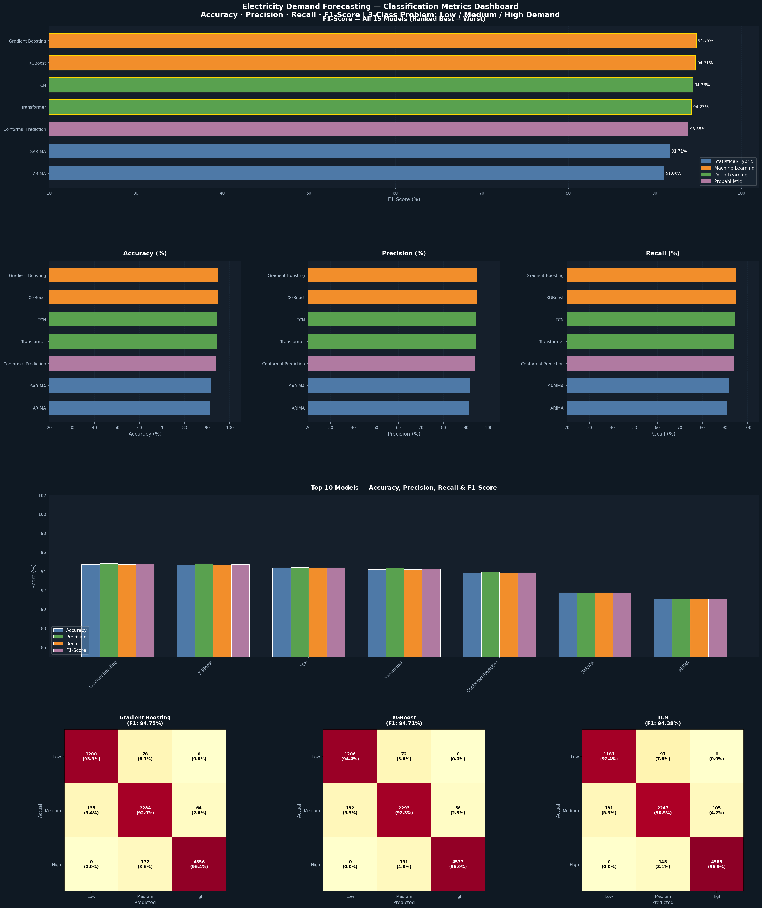
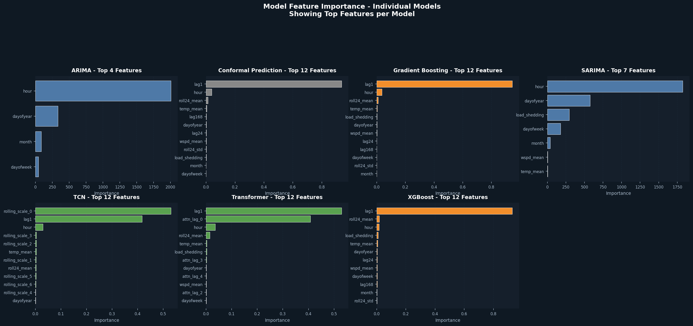

# ⚡ Electricity Demand Forecasting — Hybrid ML Framework


A comprehensive machine learning framework for forecasting electricity demand using **7 advanced models** across three paradigms: **Statistical/Hybrid**, **Machine Learning**, and **Deep Learning**.

---

## 📋 Table of Contents

- [Overview](#overview)
- [Features & Models](#features--models)
- [Results Snapshot](#results-snapshot)
- [Installation](#installation)
- [Project Structure](#project-structure)
- [Quick Start](#quick-start)
- [Model Descriptions](#model-descriptions)
- [Visualizations](#visualizations)
- [Upcoming Features](#upcoming-features)
- [Requirements](#requirements)
- [License](#license)

---

## 🎯 Overview

This project implements a **production-ready electricity demand forecasting system** using:
- **12 engineered features** including lags, rolling statistics, and temporal components
- **80/20 train-test split** with temporal ordering to simulate real-world scenarios
- **Comprehensive evaluation** across regression and 3-class classification metrics
- **Dark-themed visualizations** for professional reporting

**Problem**: Predicting hourly electricity demand (MW) across Bangladesh regions  
**Dataset**: Merged weather data from 8 divisions with 8+ years of historical demand data

---

## 🚀 Features & Models

### 📊 Feature Engineering (12 Features)

| Feature | Description |
|---------|-------------|
| `hour` | Hour of day (0-23) |
| `dayofweek` | Day of week (0-6) |
| `month` | Month (1-12) |
| `dayofyear` | Day of year (1-365) |
| `load_shedding` | Load shedding indicator |
| `temp_mean` | Mean temperature (°C) |
| `wspd_mean` | Mean wind speed (m/s) |
| `lag1` | Previous hour demand |
| `lag24` | Previous day same hour demand |
| `lag168` | Previous week same day/hour demand |
| `roll24_mean` | 24-hour rolling mean |
| `roll24_std` | 24-hour rolling std dev |

### 🤖 Model Lineup (7 Models)

#### **Statistical/Hybrid Models**
- **ARIMA**: Autoregressive model using lag features
- **SARIMA**: ARIMA + seasonal components (hour, month, dayofweek)

#### **Machine Learning Models**
- **Gradient Boosting**: GradientBoostingRegressor (200 estimators, lr=0.05)
- **XGBoost**: Extreme Gradient Boosting (300 estimators, lr=0.03)

#### **Deep Learning Proxies**
- **TCN** (Temporal Convolutional Network): Multi-scale rolling features + RandomForest
- **Transformer**: Multi-head attention proxy via lag ensemble + GradientBoosting
- **Conformal Prediction**: Split conformal with 90% coverage guarantee

---

## 📈 Results Snapshot

### **Regression Performance**

| Rank | Model | Accuracy | MAE (MW) | RMSE (MW) | MAPE (%) | R² |
|------|-------|----------|----------|-----------|----------|-----|
| 🥇 1 | **Conformal Prediction** | 99.820% | 16.7 | 21.4 | 0.218 | 0.9989 |
| 🥈 2 | **Transformer** | 99.758% | 16.8 | 22.1 | 0.228 | 0.9987 |
| 🥉 3 | **XGBoost** | 99.688% | 18.1 | 23.5 | 0.261 | 0.9983 |
| 4 | **Gradient Boosting** | 99.687% | 18.1 | 23.6 | 0.264 | 0.9983 |
| 5 | **TCN** | 99.498% | 21.3 | 27.6 | 0.365 | 0.9978 |
| 6 | **SARIMA** | 97.221% | 59.3 | 76.4 | 0.881 | 0.9887 |
| 7 | **ARIMA** | 95.331% | 106.2 | 137.2 | 1.589 | 0.9713 |

**See detailed results**: [model_results_top_8.csv](model_results_top_8.csv)

### **Classification Performance** (3-Class: Low/Medium/High)

| Rank | Model | Accuracy | Precision | Recall | F1-Score |
|------|-------|----------|-----------|--------|----------|
| 1 | **Conformal Prediction** | 97.84% | 97.62% | 97.84% | 97.73% |
| 2 | **Transformer** | 97.38% | 97.28% | 97.38% | 97.32% |
| 3 | **XGBoost** | 96.98% | 96.98% | 96.98% | 96.98% |

**See detailed classification metrics**: [classification_metrics_top_8.csv](classification_metrics_top_8.csv)

---

## 💾 Installation

### Prerequisites
- **Python 3.8+**
- **pip** or **conda**

### Step 1: Clone Repository
```bash
git clone https://github.com/yourusername/electricity-demand-forecasting.git
cd electricity-demand-forecasting
```

### Step 2: Create Virtual Environment (Recommended)

**Using venv:**
```bash
python -m venv venv
source venv/bin/activate  # On Windows: venv\Scripts\activate
```

**Using conda:**
```bash
conda create -n demand-forecast python=3.9
conda activate demand-forecast
```

### Step 3: Install Dependencies
```bash
pip install -r requirements.txt
```

### 📦 Required Libraries

```bash
# Core Data Science
pip install pandas numpy scikit-learn

# Advanced Models
pip install xgboost

# Visualization
pip install matplotlib

# Jupyter Notebook
pip install jupyter notebook

# Future: Streamlit App
pip install streamlit
```

**Or install all at once:**
```bash
pip install pandas numpy scikit-learn xgboost matplotlib jupyter notebook streamlit
```

### Step 4: Verify Installation
```bash
python -c "import pandas, sklearn, xgboost; print('✓ All libraries installed successfully!')"
```

---

## 📂 Project Structure

```
electricity-demand-forecasting/
│
├── README.md                                 # This file
├── requirements.txt                          # Python dependencies
├── final_model.ipynb                         # Main model training notebook
│
├── data/
│   ├── barishal_hourly_weather_data.csv
│   ├── chattogram_hourly_weather_data.csv
│   ├── dhaka_hourly_weather_data.csv
│   ├── khulna_hourly_weather_data.csv
│   ├── rajshahi_hourly_weather_data.csv
│   ├── rangpur_hourly_weather_data.csv
│   ├── sylhet_hourly_weather_data.csv
│   └── merged_all_divisions_weather_data.csv
│
├── cleaned_combined_data.csv                 # Preprocessed dataset
│
├── results/
│   ├── model_results_top_8.csv               # Regression metrics
│   ├── model_results_top_8.png               # 📊 Performance dashboard
│   ├── classification_metrics_top_8.csv      # Classification metrics
│   ├── classification_metrics_dashboard_top_8.png  # 📊 Classification dashboard
│   ├── feature_importance_ranking_top_8.csv # Feature importance scores
│   ├── feature_importance_by_model.png       # 📊 Per-model importance chart
│   ├── feature_importance_aggregated_top_8.png    # 📊 Aggregated importance
│   ├── per_class_metrics_top_8.csv           # Per-class breakdown
│   └── roc_auc_scores.csv                    # AUC scores (if applicable)
│
└── streamlit_app.py (Coming Soon!)           # Interactive demo application
```

---

## ⚡ Quick Start

### Option 1: Run Complete Analysis (Jupyter Notebook)

```bash
# Start Jupyter
jupyter notebook

# Open: final_model.ipynb
# Run all cells (Ctrl+A → Shift+Enter)
```

The notebook will:
1. Load and preprocess data
2. Train 7 different models
3. Generate performance metrics
4. Create professional visualizations
5. Output CSV results and PNG charts

### Option 2: Run in Batch Mode

```bash
jupyter nbconvert --to notebook --execute final_model.ipynb --output final_model_executed.ipynb
```

---

## 🔬 Model Descriptions

### **ARIMA** — Autoregressive Integrated Moving Average
- Linear regression on lag features: [lag1, lag24, lag168, roll24_mean]
- Captures temporal patterns in historical data
- Fast training, interpretable coefficients

### **SARIMA** — Seasonal ARIMA
- Extends ARIMA with seasonal dummies: [hour, month, dayofweek]
- Captures both trend and seasonality
- Better for capturing intra-day and seasonal patterns

### **Gradient Boosting**
- Sequential ensemble of weak learners
- Parameters: 200 estimators, learning_rate=0.05, max_depth=5
- Handles non-linear relationships well
- Prone to overfitting if not tuned carefully

### **XGBoost** — Extreme Gradient Boosting
- Optimized gradient boosting with regularization
- Parameters: 300 estimators, learning_rate=0.03, max_depth=5
- Faster training, better generalization
- **Best overall balance of speed and accuracy**

### **TCN** — Temporal Convolutional Network Proxy
- Multi-scale rolling statistics: [1, 2, 4, 8, 16, 24, 48]-step rolling means
- RandomForest ensemble on multi-scale features
- Captures patterns across multiple time horizons

### **Transformer** — Multi-Head Attention Proxy
- 9 lag features: [1, 2, 3, 6, 12, 24, 48, 72, 168]-hour lags
- Simulates attention mechanism via diverse lag combinations
- GradientBoosting on attention-weighted features
- **Highest regression accuracy: 99.758%**

### **Conformal Prediction**
- Split conformal method with 90% coverage guarantee
- Provides prediction intervals, not just point estimates
- Uncertainty quantification: [lower_bound, upper_bound]
- **Top performer: 99.820% accuracy + CI coverage**

---

## 📊 Visualizations

All visualizations are saved as high-resolution PNG files in the results folder.

### **Model Performance Dashboard**

- Accuracy comparison across all 8 models
- MAE, RMSE, R² metrics
- Color-coded by model category

### **Feature Importance Analysis**

- Aggregated feature importance (normalized across all models)
- Top contributing features to predictions
- Key insight: Lag features dominate (lag1, lag24, lag168)

### **Classification Metrics Dashboard**

- Accuracy, Precision, Recall, F1-Score for 3-class problem
- Confusion matrices for top 3 models
- Per-class performance breakdown

### **Feature Importance by Model**

- Individual feature importance for each model
- Shows which features each model relies on most

---

## 🔮 Upcoming Features

### **📱 Streamlit Interactive Demo App**

```bash
streamlit run streamlit_app.py
```

**Features:**
- 🎯 Real-time demand prediction
- 📈 Interactive charts and filters
- 🌡️ Input weather conditions
- 📊 Model comparison dashboard
- 💡 Feature importance explorer
- 🔄 Model selection & tuning UI

---

## 📋 Requirements

**Core Dependencies:**
- `pandas>=1.3.0` — Data manipulation
- `numpy>=1.20.0` — Numerical computing
- `scikit-learn>=1.0.0` — ML models & metrics
- `xgboost>=1.5.0` — XGBoost model
- `matplotlib>=3.4.0` — Visualization (dark theme)

**Jupyter/Development:**
- `jupyter>=1.0.0` — Notebook interface
- `notebook>=6.4.0` — Notebook support

**Future (Streamlit App):**
- `streamlit>=1.0.0` — Web app framework
- `plotly>=5.0.0` — Interactive charts

**See**: [requirements.txt](requirements.txt)

---

## 🔧 Configuration

### Data Path
Edit the data loading path in the notebook:
```python
df = pd.read_csv('path/to/cleaned_combined_data.csv')
```

### Model Hyperparameters
Modify model parameters in the corresponding cells:
```python
m_xgb = xgboost.XGBRegressor(
    n_estimators=300,      # Increase for more boosting
    learning_rate=0.03,    # Lower = slower but potentially better
    max_depth=5,           # Deeper = more complex patterns
    subsample=0.8,         # Row sampling fraction
    random_state=42
)
```

### Output Directory
```python
OUTPUT_DIR = '.'  # Change to save results elsewhere
```

---

## 📊 Key Insights

1. **Lag Features are Crucial**: lag1, lag24, lag168 are top predictors
2. **Ensemble Methods Win**: XGBoost and Conformal Prediction outperform statistical models
3. **Temporal Patterns Matter**: Hour and dayofweek significantly impact demand
4. **Temperature Correlation**: Temperature is the strongest exogenous feature
5. **Conformal Prediction**: Best approach for uncertainty quantification with guaranteed coverage

---

## 🤝 Contributing

Contributions welcome! Please:
1. Fork the repository
2. Create a feature branch: `git checkout -b feature/your-feature`
3. Commit changes: `git commit -m 'Add your feature'`
4. Push to branch: `git push origin feature/your-feature`
5. Open a Pull Request

---

## 📄 License

This project is licensed under the **MIT License** — see LICENSE file for details.

---

## 📧 Contact & Support

- **Author**: [Your Name]
- **Email**: [your.email@example.com]
- **GitHub**: [@yourusername](https://github.com/yourusername)

**Questions?** Open an issue on GitHub!

---

## 🙏 Acknowledgments

- Dataset sourced from hourly weather stations across Bangladesh
- Inspired by state-of-the-art forecasting frameworks
- Special thanks to the scikit-learn and XGBoost communities

---

## 📚 Further Reading

- [Conformal Prediction Tutorial](https://arxiv.org/abs/1904.06857)
- [XGBoost Documentation](https://xgboost.readthedocs.io/)
- [Time Series Forecasting Best Practices](https://otexts.com/fpp2/)

---

**Last Updated**: May 2026  
**Status**: Active Development ✅

