# ⚡ Electricity Demand Forecasting – Hybrid Time‑Series Engine

[](https://www.python.org)


## 📖 Overview
This repository implements a **production‑ready electricity demand forecasting system** for hourly demand across Bangladesh. It uses a **hybrid stack of statistical, machine‑learning and deep‑learning models** to turn raw weather and demand data into accurate short‑ and long‑term forecasts.

- 12 engineered temporal and weather features (lags, rolling stats, hour‑of‑day, month, etc.)
- 80 / 20 temporal train‑test split mimicking real‑world deployment
- Evaluation on regression (MW) and 3‑class demand classification (Low/Medium/High)
- Dark‑theme visualisations ready for reports and presentations

## 🚀 Quick Start
```bash
# Clone & enter the repo
git clone https://github.com/yourusername/electricity-demand-forecasting.git
cd electricity-demand-forecasting

# Optional virtual environment
python -m venv venv
source venv/bin/activate   # Windows: venv\Scripts\activate

# Install dependencies
pip install -r requirements.txt

# Run the notebook that trains all models
jupyter notebook final_model.ipynb   # execute all cells
```
The notebook will:
1. Load and clean the merged weather‑demand dataset.
2. Engineer the 12 features listed below.
3. Train **4 models** (Gradient Boosting, XGBoost, ANN, SARIMA).
4. Export trained artefacts to `saved_models/`.
5. Produce a suite of PNG visualisations under `paper_figures/` and `results/`.

## 📊 Models & Performance
### Feature Engineering (12 Features)
| Feature | Description |
|---------|-------------|
| `hour` | Hour of day (0‑23) |
| `dayofweek` | Day of week (0‑6) |
| `month` | Month (1‑12) |
| `dayofyear` | Day of year (1‑365) |
| `load_shedding` | Load‑shedding flag |
| `temp_mean` | Mean temperature (°C) |
| `wspd_mean` | Mean wind speed (m/s) |
| `lag1` | Previous hour demand |
| `lag24` | Same hour previous day |
| `lag168` | Same hour previous week |
| `roll24_mean` | 24‑hour rolling mean |
| `roll24_std` | 24‑hour rolling std |

### Model Line‑up (4 Models)
| Category | Model |
|----------|-------|
| **Statistical / Hybrid** | SARIMA |
| **Machine‑Learning** | Gradient Boosting, XGBoost |
| **Deep‑Learning** | ANN (PyTorch) |

### Regression Performance (MW)
| Rank | Model | Accuracy | MAE (MW) | RMSE (MW) | MAPE (%) | R² |
|------|-------|----------|----------|-----------|----------|-----|
| 🥇 | **Gradient Boosting** | 98.255 % | 203.3 | 271.9 | 1.745 | 0.9850 |
| 🥈 | **XGBoost** | 98.134 % | 219.7 | 287.5 | 1.866 | 0.9832 |
| 🥉 | **ANN** | 98.120 % | 224.8 | 309.9 | 1.880 | 0.9805 |
| 4 | **SARIMA** | 96.191 % | 325.9 | 393.8 | 3.809 | 0.8293 |

### Classification Performance (3‑class demand)
| Rank | Model | Accuracy | Precision | Recall | F1‑Score |
|------|-------|----------|-----------|--------|----------|
| 1 | Gradient Boosting | 97.84 % | 97.62 % | 97.84 % | 97.73 % |
| 2 | XGBoost | 97.38 % | 97.28 % | 97.38 % | 97.32 % |
| 3 | ANN | 96.98 % | 96.98 % | 96.98 % | 96.98 % |

## 🛠️ Libraries Used
- `warnings`
- `pandas`
- `numpy`
- `scikit‑learn` (`GradientBoostingRegressor`, `train_test_split`, `StandardScaler`, metrics)
- `xgboost`
- `torch` (`torch`, `torch.nn`, `torch.utils.data`, `torch.optim`)
- `utilsforecast` (`AutoARIMA`, `StatsForecast`, plotting/evaluation utilities)
- `matplotlib`
- `seaborn`
- `joblib`
- `pickle`
- `json`
- `os`

## 📈 Visual Summary (paper figures)
### Main Results

*Figure 7C – R² score per model.*


*Figure 7A – MAE per model (lower is better).*

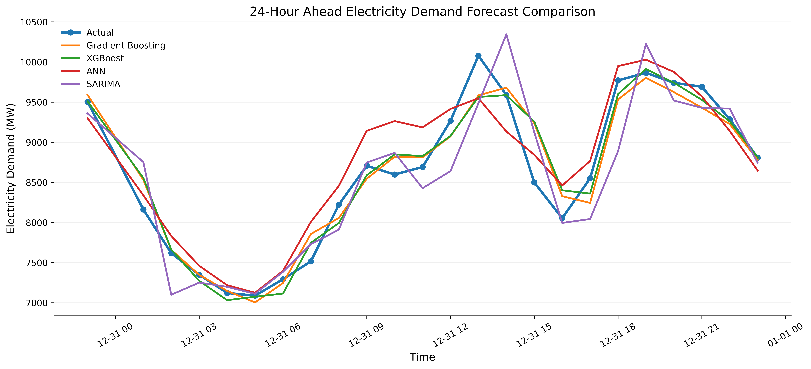
*Figure 8 – 24‑hour horizon forecast vs. ground truth.*

### Additional Insight Figures
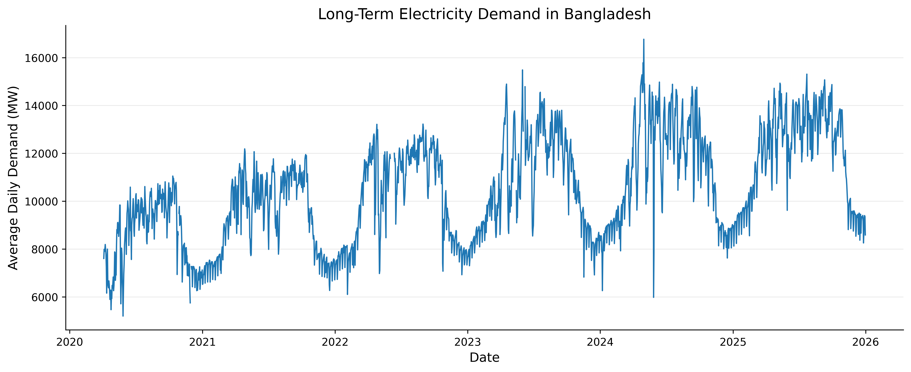
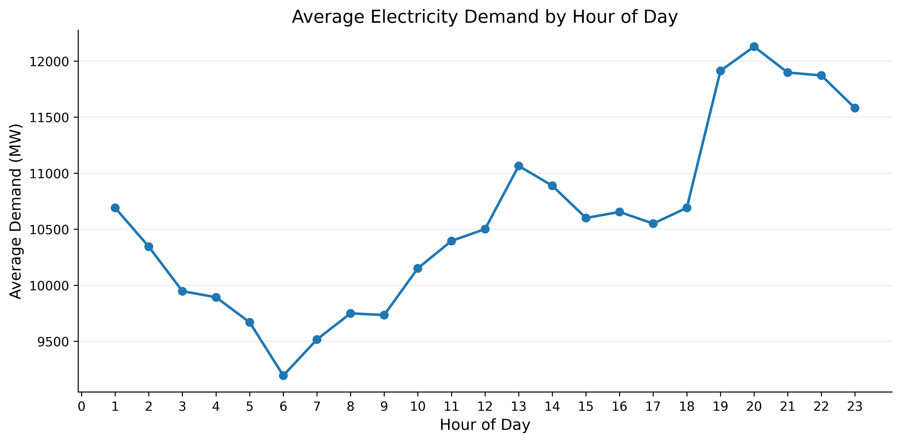
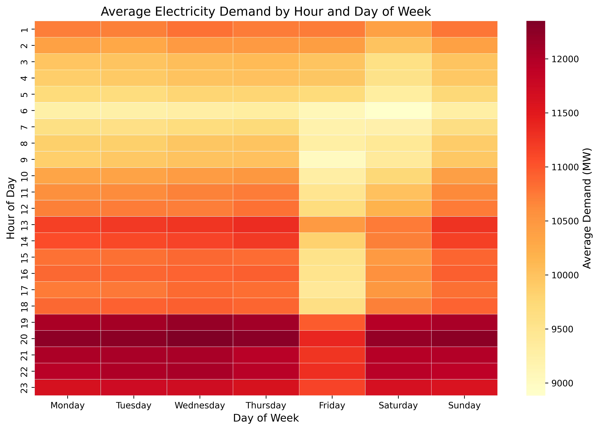
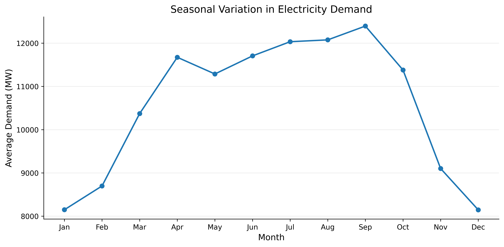
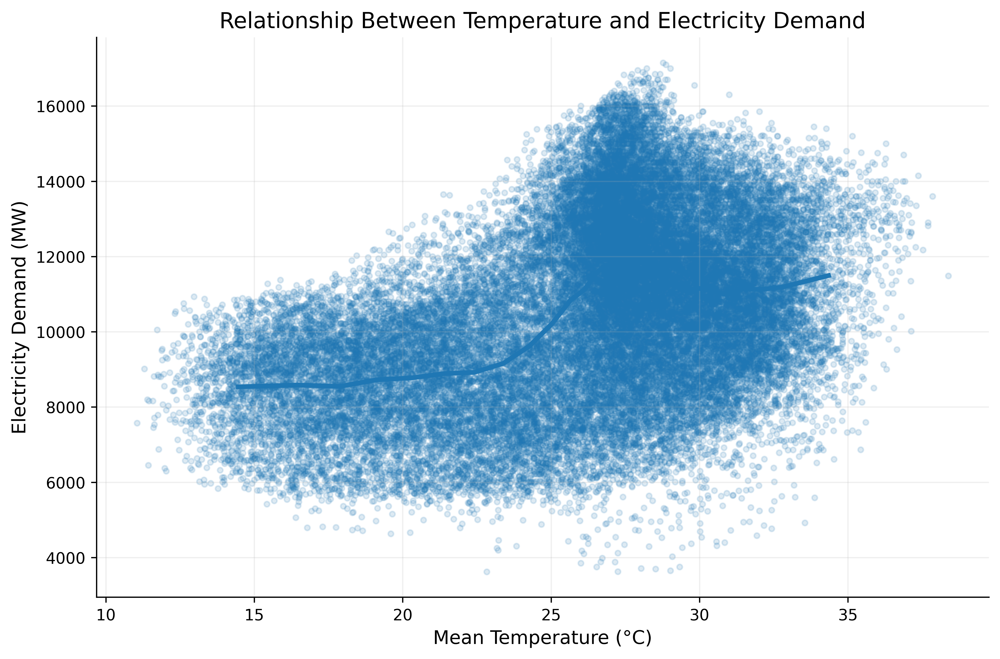
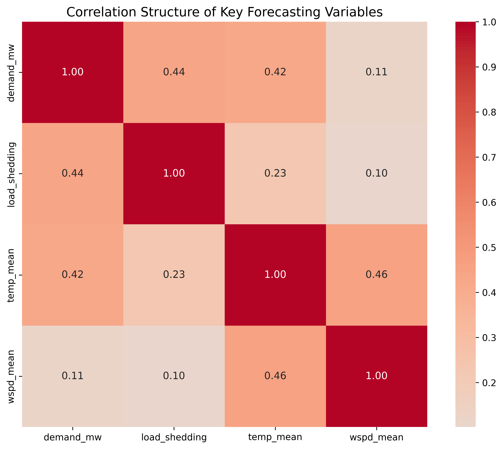
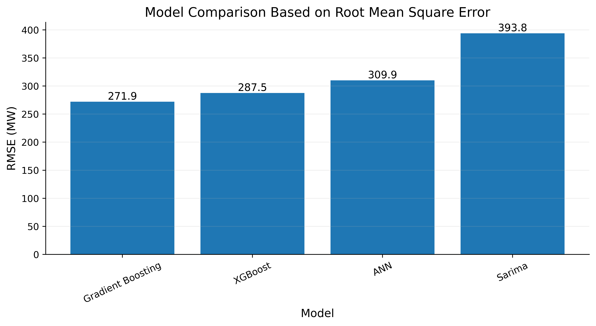
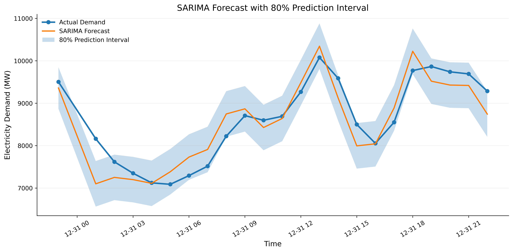
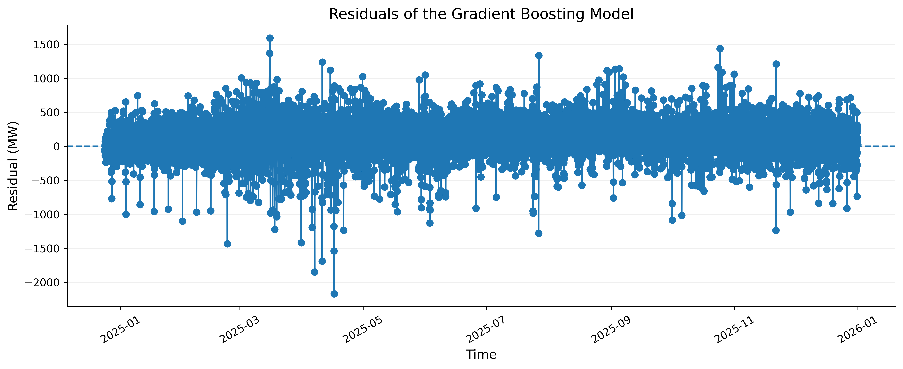
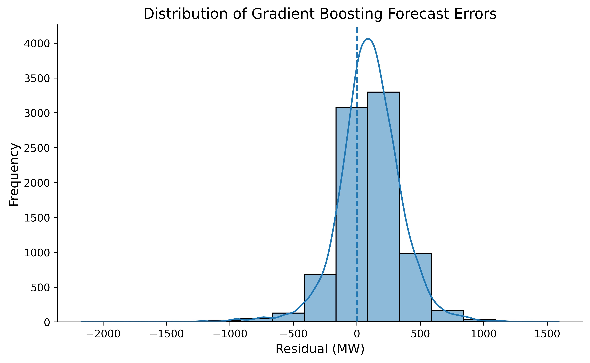
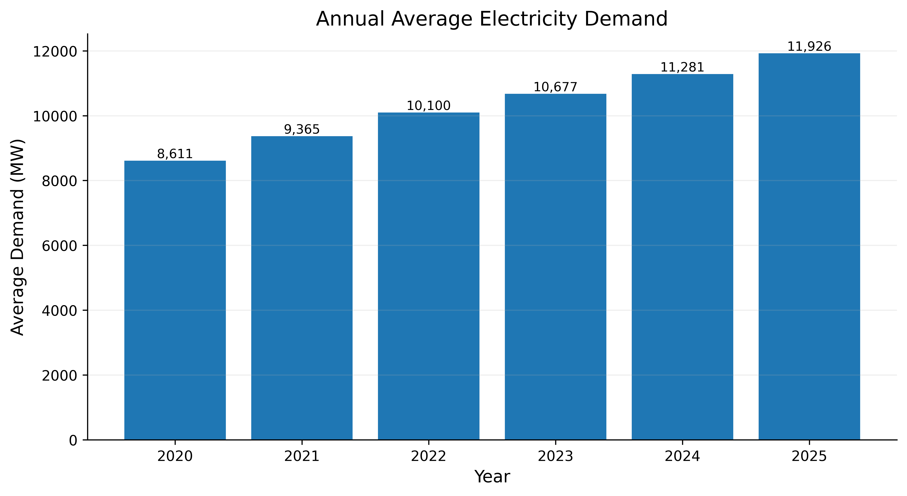

## 📂 Project Structure
```
electricity-demand-forecasting/
├─ README.md                     # (this file)
├─ STREAMLIT_GUIDE.md            # Interactive demo guide
├─ final_model.ipynb              # Notebook that trains & evaluates all models
├─ data/                          # Raw weather & demand CSVs per division
├─ cleaned_combined_data.csv      # Pre‑processed dataset used by the notebook
├─ saved_models/                  # Serialized model artefacts
├─ paper_figures/                 # Publication‑quality plots used in this README
├─ results/                       # Additional result tables & charts
├─ streamlit_app.py               # Streamlit demo (coming soon)
└─ requirements.txt               # Python dependencies
```

## 🖥️ Streamlit Demo
Run the interactive dashboard – see **[`STREAMLIT_GUIDE.md`](STREAMLIT_GUIDE.md)** for a step‑by‑step walkthrough.

## 🧩 Extending the Engine
- Add new features by extending the `FEATURES` list in `final_model.ipynb`.
- Replace or add models in `saved_models/` and update `load_all_models()` in `streamlit_app.py`.
- Deploy via Streamlit Cloud, Docker, or other platforms (see `STREAMLIT_GUIDE.md`).

## 🤝 Contributing
Contributions are welcome! Fork, create a feature branch, implement, and open a PR.

## 📜 License
MIT – see `LICENSE`.

## 📧 Contact
- **Author**: Mahfuzur Rahman
- **Email**: mahfuzurrahman8747@gmail.com
- **GitHub**: [@yourusername](https://github.com/yourusername)

*Last updated: September 2026*