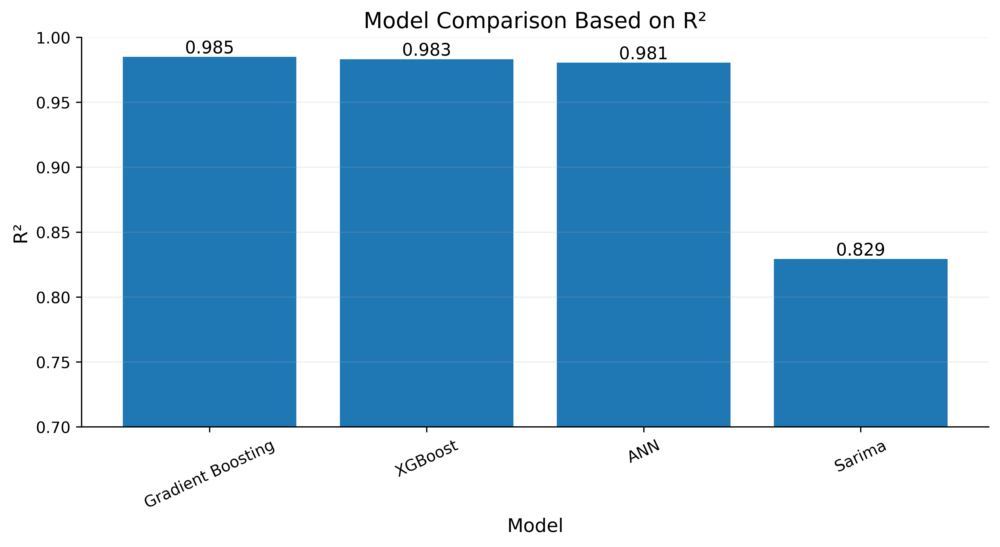
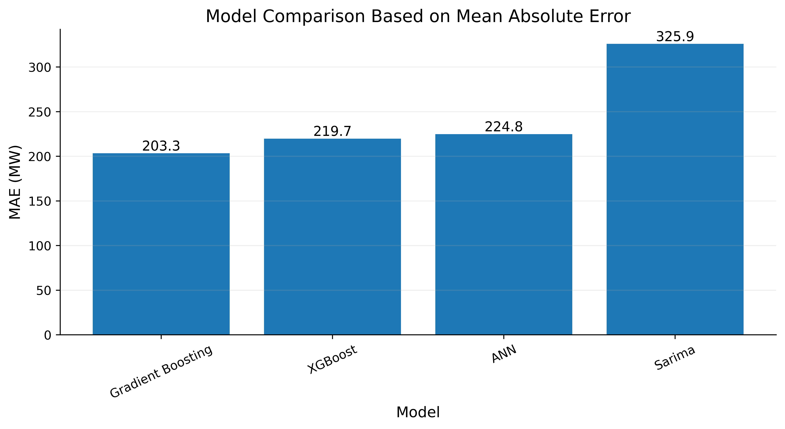

# 🌐 Streamlit Demo – Interactive Electricity Demand Forecast

This guide walks you through launching the **Streamlit** dashboard that showcases the hybrid time‑series engine from this repository.  The app lets you:
- Pick any of the 7 pre‑trained models
- Adjust weather and temporal inputs
- See real‑time demand predictions (MW) and the corresponding demand class (Low/Medium/High)
- Visualise model performance and feature importance on the fly

---

## 📦 Prerequisites
| Item | Why? |
|------|------|
| Python 3.8+ | Required by the notebook and Streamlit runtime |
| `requirements.txt` | Pinpointed library versions for reproducibility |
| Trained model artefacts (`saved_models/`) | The app loads these at start‑up |

If you haven't installed the dependencies yet, run:
```bash
pip install -r requirements.txt
```

## 📂 Directory Layout (relevant parts)
```
electricity-demand-forecasting/
├─ streamlit_app.py            # Main Streamlit entry point
├─ saved_models/               # Serialized models & scalers
│   ├─ M_ANN.pth
│   ├─ M_XGBoost.pkl
│   └─ ...
├─ paper_figures/              # High‑resolution plots used in docs
└─ ...
```

## 🚀 Launch the Dashboard
```bash
streamlit run streamlit_app.py
```
The app will open at **http://localhost:8501** (or another free port if 8501 is taken).  If you need a specific port:
```bash
streamlit run streamlit_app.py --server.port 8502
```

---

## 🖥️ UI Overview
### 1️⃣ Sidebar Controls
- **Model selection** – Dropdown lists the 7 models (ARIMA … Conformal Prediction).
- **Temporal inputs** – Hour, day‑of‑week, month.
- **Weather inputs** – Temperature (°C) and wind speed (m/s).
- **Load‑shedding toggle** – Binary flag for grid interruptions.
- **Lag features** – Auto‑filled from the most recent demand values (or you can edit them).

### 2️⃣ Main Panel
- **Prediction card** – Shows the forecasted demand (MW) and its class with a colour‑coded badge.
- **Model performance card** – Pulls the latest accuracy/MAE from `paper_figures/Fig7C_R2_comparison.png` and `Fig7A_MAE_comparison.png` – see the images below.
- **Feature importance bar chart** – Dynamically generated from the selected model’s permutation importance.
- **24‑hour forecast line chart** – Historical demand (gray) vs. predicted (blue) with a confidence interval (if the model provides it).

#### 📈 Sample Screenshots (paper figures)

*R² scores across all models.*


*Mean Absolute Error per model.*

---

## ⚙️ Customising the App
### Adding a New Model
1. Serialize the trained model to `saved_models/` (pickle, torch, etc.).
2. Append a loading entry in `load_all_models()` of `streamlit_app.py`.
3. The new model will automatically appear in the sidebar dropdown.

### Tweaking the UI Theme
The dark theme is hard‑coded for presentation quality.  To switch to a light theme, edit the CSS block near the top of `streamlit_app.py`:
```python
st.markdown("""
<style>
    .stApp { background-color: #FFFFFF; }
</style>
""", unsafe_allow_html=True)
```

### Changing Input Ranges
Modify the `st.number_input` calls in `streamlit_app.py` – e.g., to widen the temperature range:
```python
temp = st.number_input("Temperature (°C)", min_value=-30, max_value=50, value=25)
```

---

## 🐛 Troubleshooting
| Symptom | Fix |
|---------|-----|
| `ModuleNotFoundError: streamlit` | `pip install streamlit` |
| Model files missing | Ensure `saved_models/` contains the .pkl/.pth files; re‑run `final_model.ipynb` to generate them. |
| Port already in use | Start with a different port: `streamlit run streamlit_app.py --server.port 8502` |
| Predictions return `NaN` | Check that all inputs are within the training range (see the *Input Ranges* section above). |

---

## 📦 Deployment Options
### Streamlit Cloud (quick, free)
1. Push the repository to GitHub.
2. Sign‑in at https://share.streamlit.io and select the repo.
3. Set the entry‑point to `streamlit_app.py`.
4. Deploy – a public URL will be generated.

### Docker (self‑hosted)
```dockerfile
FROM python:3.9-slim
WORKDIR /app
COPY . .
RUN pip install --no-cache-dir -r requirements.txt
EXPOSE 8501
CMD ["streamlit", "run", "streamlit_app.py", "--server.port", "8501"]
```
Build & run:
```bash
docker build -t demand‑forecast .
docker run -p 8501:8501 demand‑forecast
```

### Heroku (deprecated) – see Streamlit Cloud instead.

---

## 📚 Further Reading & References
- **Conformal Prediction** – https://arxiv.org/abs/1904.06857
- **Time‑Series Forecasting** – Hyndman & Athanasopoulos, *Forecasting: Principles and Practice*
- **XGBoost Documentation** – https://xgboost.readthedocs.io/

---

## 🤝 Contributing
Feel free to open issues or pull requests.  Typical contributions include:
- Adding new weather or calendar features
- Implementing a true deep‑learning model (LSTM, Prophet, etc.)
- Improving visualisations (interactive Plotly charts, map overlays)

---

## 📧 Support
If you run into problems, try the troubleshooting table above.  For anything else, reach out via:
- Email: mahfuzurrahman8747@gmail.com
- GitHub Issues: https://github.com/yourusername/electricity-demand-forecasting/issues

---

**Happy forecasting!** ⚡📊

*Last updated: September 2026*