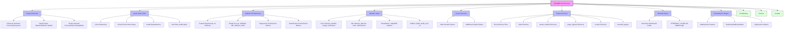

```mermaid
flowchart TD
    A[README.md Overview] --> B[Project Overview]
    A --> C[Quick Start Guide]
    A --> D[Models & Performance]
    A --> E[Libraries Used]
    A --> F[Visual Summary]
    A --> G[Project Structure]
    A --> H[Streamlit Demo]
    A --> I[Extending the Engine]
    A --> J[Contributing]
    A --> K[License]
    A --> L[Contact]
    
    B --> B1[Electricity Demand Forecasting System]
    B --> B2[Hybrid Stack: Statistical/ML/DL Models]
    B --> B3[Hourly Demand Forecasting for Bangladesh]
    
    C --> C1[Clone Repository]
    C --> C2[Virtual Environment Setup]
    C --> C3[Install Dependencies]
    C --> C4[Run final_model.ipynb]
    
    D --> D1[Feature Engineering: 12 Features]
    D --> D2[Model Line-up: SARIMA, GB, XGBoost, ANN]
    D --> D3[Regression Performance Metrics]
    D --> D4[Classification Performance Metrics]
    
    E --> E1[Core Libraries: pandas, numpy, scikit-learn]
    E --> E2[ML Libraries: xgboost, torch, utilsforecast]
    E --> E3[Visualization: matplotlib, seaborn]
    E --> E4[Utilities: joblib, pickle, json, os]
    
    F --> F1[Main Results Figures]
    F --> F2[Additional Insight Figures]
    
    G --> G1[Root Directory Files]
    G --> G2[data/ Directory]
    G --> G3[saved_models/ Directory]
    G --> G4[paper_figures/ Directory]
    G --> G5[results/ Directory]
    G --> G6[streamlit_app.py]
    
    H --> H1[Interactive Dashboard Guide]
    H --> H2[STREAMLIT_GUIDE.md Walkthrough]
    
    I --> I1[Adding New Features]
    I --> I2[Replacing/Adding Models]
    I --> I3[Deployment Options]
    
    style A fill:#f9f,stroke:#333,stroke-width:2px
    style B fill:#bbf,stroke:#333
    style C fill:#bbf,stroke:#333
    style D fill:#bbf,stroke:#333
    style E fill:#bbf,stroke:#333
    style F fill:#bbf,stroke:#333
    style G fill:#bbf,stroke:#333
    style H fill:#bbf,stroke:#333
    style I fill:#bbf,stroke:#333
    style J fill:#dfd,stroke:#333
    style K fill:#dfd,stroke:#333
    style L fill:#dfd,stroke:#333
```
```